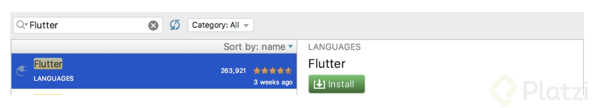
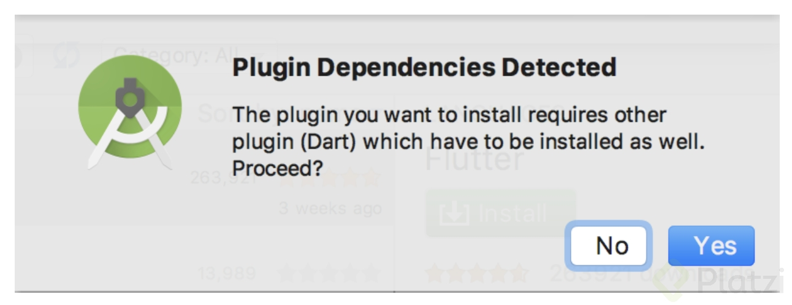
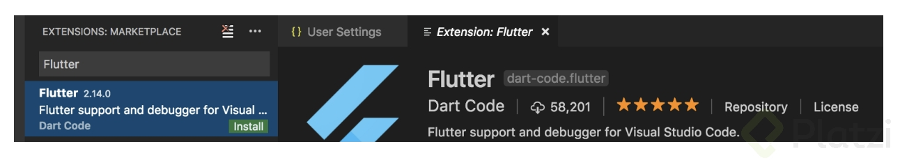

# Instalación de Flutter
La instalación de Flutter es muy sencilla y se comportará ligeramente imparcial en todos los Sistemas Operativos. Tenemos dos opciones en entornos de desarrollo.

## Android Studio y Visual Studio Code

### SDK Flutter
Antes que todo necesitarás descargar el SDK de Flutter, este es el kit de librerías y herramientas que necesitas para desarrollar.

Descárgalo haciendo click aquí https://flutter.io/docs/get-started/install y posteriormente elige tu Sistema Operativo.

Estarás descargando un archivo flutter_xxx_v1xxx.zip descomprímelo y déjalo disponible en tu carpeta home o en un lugar de tu computadora que no sea vulnerable a ser borrado.

## Android Studio
Una vez tengas instalado Android Studio, puedes descargarlo de aquí https://developer.android.com/studio/?hl=es-419 , instalaremos el Plugin de Flutter, para esto ve al IDE en la opción de Preferences > Plugins en Mac o en Windows/Linux File > Settings > Plugins.

En la ventana que se abre da click en la parte inferior en el botón Browse repositories. Se sobrepondrá otra nueva ventana ahí escribe Flutter, da click en Install.

A continuación te solicitará instalar el Plugin de Dart da click en Yes.

Reinicia el IDE Android Studio y todo listo.

## Visual Studio Code
Una vez hayas descargado Visual Studio Code https://code.visualstudio.com/download procederemos a instalar el Plugin de Flutter y Dart.

Abre el Editor y dirígete al menú View > Command Palette teclea la palabra install y selecciona: Extensions: Install Extension

Ahora escribe Flutter y da click en install.

Reinicia el Editor realiza los pasos anteriores y escribe Dart. Instálao, reinicia y listo.

## Desarrollo para iOS
Recuerda que si tienes una computadora Mac puedes compilar el código a la versión de iOS. Para ello es importante que previamente tengas instalado y configurado XCode. Puedes mirar la clase aquí: https://platzi.com/clases/1428-interfaces-ios/15482-instalacion-de-xcode-desde-0/